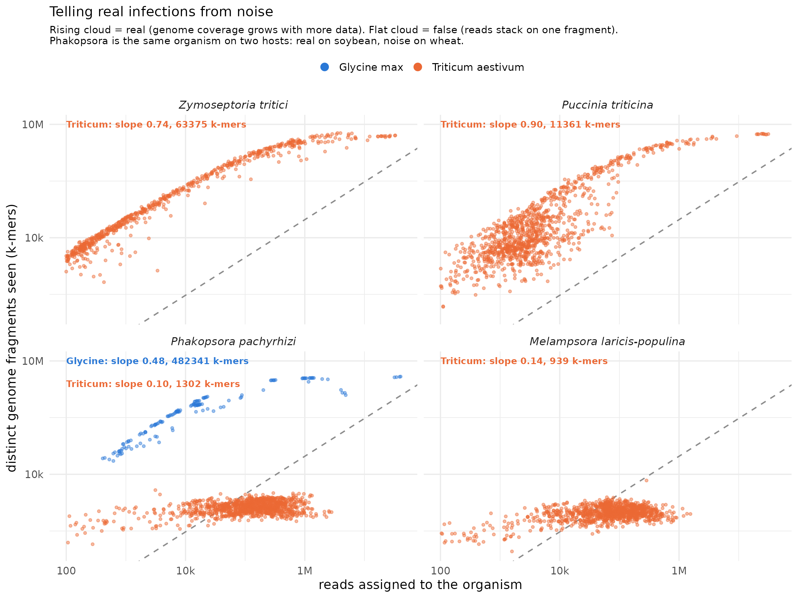
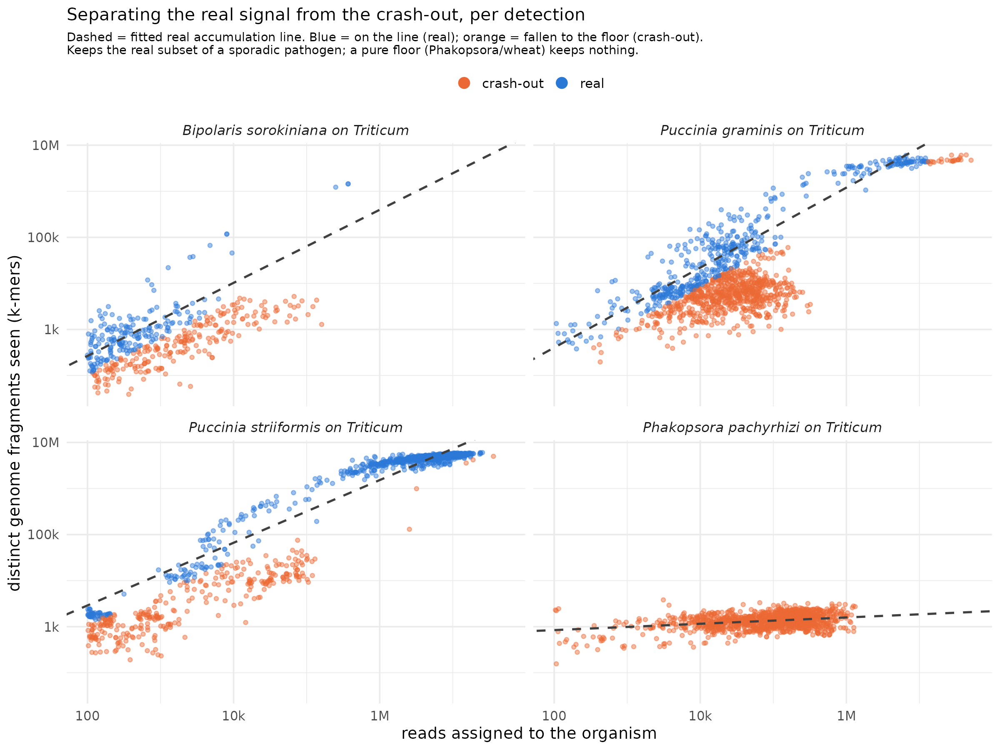

# Detection filter: real infections vs classifier artefacts

Deciding which Kraken2 pathogen detections in the SRA screen are real and which are
artefacts. Short version: a real infection leaves a genome-wide signal that grows as we
sequence deeper; a false one does not.

## The problem

Kraken2 assigns reads to species by matching short genome fragments (k-mers). It is
sensitive but it over-calls. Reads from a conserved region shared across many fungi, or
from a close relative of something genuinely present, pile onto a species that was never
there. A raw read count cannot separate these from true detections: soybean rust was
"detected" in almost every wheat sample, which is not credible.

## The insight

Count how much of an organism's genome we actually see (distinct k-mers), not how many
reads landed on it. A real infection accumulates new k-mers as reads increase, so its
cloud rises. A false one stacks reads onto the same small fragment, so its cloud stays
flat no matter how much data arrives.



*Zymoseptoria* and *Puccinia triticina* on wheat rise cleanly (real). *Melampsora*
(poplar rust) on wheat is flat (noise). *Phakopsora* (soybean rust) is the same organism
read on two hosts: a genuine rising infection on soybean, a flat artefact on wheat. The
classifier makes the same call on both; the shape of the cloud tells them apart.

## The signal is shape, not abundance

Two numbers frame it:

- **Level**: how much genome we saw (distinct k-mers). A pile-up sits on a floor of
  ~1,000; a real detection reaches tens of thousands to millions.
- **Slope**: whether coverage grows with depth. Real ~0.7 to 0.9; a pile-up ~0.

A detection needs to fail both (low level *and* flat) to be an artefact. Level alone
rescues saturated real infections (soybean rust is flat only because its genome is
already fully covered); slope alone rescues genuine but shallow infections.


## It depends on the host

The same organism can be real on its own host and a cross-mapping artefact on another,
so the test is applied per host, not globally.


Read across a row: *Sclerotinia* is real on canola and soybean (blue) but noise on wheat
(red); stripe rust (*Puccinia striiformis*) is real on wheat but noise on maize. The
colours track known host ranges, the check that the method measures real biology.

## formae speciales split the crowded clouds

*Puccinia graminis* and the other rusts on wheat show two overlapping clouds, one rising
and one flat, with a single fitted line running straight through both. The split is
biological: the reads separate by *forma specialis*. Broad, genome-wide coverage lands on
the species node (real); reads biased onto one f.sp. sliver crash to the floor (artefact
of LCA smearing). Treating each f.sp. as its own detection resolves the two clouds.


The current classifier folds this in as an `unbiased` feature (1 minus the f.sp. fraction
of species reads), so a detection dominated by one sub-taxon is penalised.

## How the classifier scores a detection

`detect.py` scores every (host x species) cloud, then labels each point real or crash-out.
Five features, each 0 to 1, combined as a weighted mean; real if score >= 0.5:

| feature   | meaning                                   | weight |
|-----------|-------------------------------------------|:------:|
| tightness | R2 of the upper accumulation line         | 0.20   |
| rising    | slope of that line, clipped               | 0.25   |
| coverage  | distinct / genome ceiling, log-scaled     | 0.20   |
| on_line   | this point's residual vs the fitted line  | 0.15   |
| unbiased  | 1 minus f.sp. fraction                    | 0.20   |



## Status

The weights are a provisional operating point, not a calibrated model. Fitting them to
PHI-base labels made coverage dominate and crushed low-abundance real detections; dropping
coverage over-rejected obvious reals (striiformis to 0%). The declared-pathogen ground
truth is biased toward abundant infections, so no automated fit converges cleanly. These
hand weights sit between the failure modes and err toward sensitivity: crash-outs are kept
as a separate labelled group rather than deleted, so a wrong call can still be recovered
downstream. Real calibration waits on the planned read-level alignment, which is the
ground truth this filter should be tuned against. See the memory note
`crypt-kmer-fraction-criterion` for the full arc.

Alternative separation methods tried (a 1D line residual, a GMM cluster, a rarefaction
test) are compared in `figures/method_comparison.png`; none beat the scored per-host model.

## Co-occurrence networks and the co-infection rate

`figures/prep_network.py` + `figures/network.R` build a per-host pathogen co-occurrence
network (`figures/networks/`). Two thresholds gate what counts as a co-infection, and they
answer two different questions:

- **`score >= 0.7`** (real-shape): the detection has a genuine accumulation curve, not a
  pile-up artefact. Conservative: it keeps ~94% of known-real detections and removes 100%
  of the known off-host artefacts (Phakopsora/wheat, Melampsora/wheat, striiformis/maize).
- **`coverage >= 1%`** (DNA present): at least 1% of the organism's genome k-mer space is
  seen in that sample. Without it, the rate is dominated by trace detections: a few hundred
  reads of a species sitting on its real curve counted as an infection, pushing wheat
  co-infection to 80%. The floor brings it to a defensible level (wheat 47%, maize 39%).

Edges are not raw co-occurrence counts. Two common pathogens share a sample by chance, so a
count-based edge links everything to everything (74% of wheat pairs). Instead each pair is
tested against a null built from the two prevalences (Fisher's exact, one-sided); an edge is
a co-occurrence **beyond chance** (BH-adjusted p < 0.05), width = log2 fold-enrichment.

### Why 1% coverage is defensible, and what it does not prove

1% of a median pathogen genome is ~50,000 distinct genomic k-mers observed, spread across
the genome. For an organism that is not present, random 35-mer collisions yield essentially
zero distinct matches, so ~50k k-mers is about three orders of magnitude above the
random-match null. **1% coverage objectively means the organism's DNA is present in the
sample.** That is the claim it supports, and it is quantitative.

It is **not** an artefact-rate control, and we do not claim it is. We tried to anchor a floor
to a false-positive rate using the cleanest artefact null available (obligate rusts and
powdery mildew detected on hosts they physically cannot infect, i.e. pure cross-mapping):
that null reaches 13% coverage at its 75th percentile and up to 74%. So coverage does not
separate real infection from artefact. The high off-host coverage is real organism DNA
present for other reasons (spore drift onto the wrong crop, or a mis-called host), not a
k-mer artefact. Consequently:

- DNA presence is not proof of **active** co-infection. Spore contamination, surface
  inoculum, and mixed samples all deposit real DNA. This limitation applies to all
  SRA-based co-infection inference; it is disclosed, not thresholded away.
- Which reads belong to which organism when congeners share genome, and whether a call
  survives competitive assignment, cannot be settled by Kraken2 k-mer counts. That is the
  job of the `align` module (competitive read assignment, per-gene resolution), which is the
  ground truth these thresholds should ultimately be checked against.

`THRESH` and `COVFLOOR` are one-line parameters in `prep_network.py`.

## What this changes

The co-infection rate is built from the kept detections only. The filter removes roughly
a fifth of pathogen detections cohort-wide, and the survivors are dominated by the
pathogens each crop actually gets.

## Layout

```
detect.py            classifier: scores every host x species cloud -> data/_classified.tsv
charts.R             one chart per species (63), faceted by host, points coloured by score
charts/              the 63 per-species PNGs
data/                classifier output + figure inputs (large tables gitignored, rebuilt from reports)
figures/             the explanatory figures and their scripts, plus:
  prep_taxonomy.py     pathogen/host lineages (PHI-base taxids + NCBI dump) for the trees
  composite.R          taxonomy-ordered grid of every detection cloud (composite_grid.{png,pdf})
  prep_network.py      co-occurrence association edges/nodes per host (score + coverage floors)
  network.R            per-host co-occurrence networks
  networks/            one network PNG per host with enough co-occurrence
_scratch/            earlier exploratory versions of the idea, kept for reference
```

Run from the repository root (`phd/01-review`):

```
python3 03_kraken/05_filter/detect.py            # -> data/_classified.tsv (score + coverage per detection)
Rscript  03_kraken/05_filter/charts.R            # -> charts/*.png
python3 03_kraken/05_filter/figures/prep_network.py && Rscript 03_kraken/05_filter/figures/network.R
```

Figure scripts under `figures/` regenerate the same way (prep `.py` then `.R`). Inputs are
the Kraken2 reports in `03_kraken/04_assign/data/reports/` (gitignored data, on Setonix) and the
read-based host calls in `03_kraken/04_assign/host/`.
