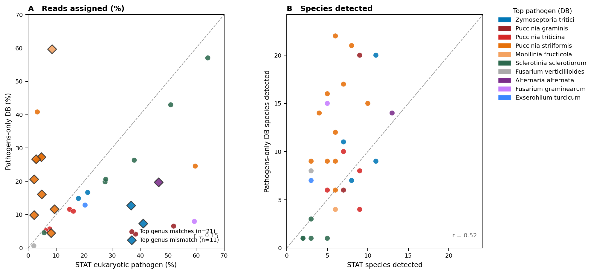

## Kraken2 database comparison: masked+hosts vs unmasked vs pathogens-only vs STAT

### Figure 1: Masked+hosts vs unmasked (`masked_vs_unmasked.png`)

### Figure 2: Masked+hosts vs pathogens-only (`masked_vs_pathogens.png`)

### Figure 3: STAT euk% vs pathogens-only Kraken2 DB (`stat_vs_pathogens.png`)

### Background and motivation

NCBI STAT pre-computed k-mer taxonomy was used in the upstream pipeline to screen
~593k SRA runs for co-infection signal. Screening microbe-as-library (MAL) runs —
runs where the sequenced organism is itself a PHI-base plant pathogen — revealed
that a large proportion returned zero detected eukaryotic pathogen reads in STAT,
particularly for wheat stripe rust (*Puccinia striiformis* f. sp. *tritici*, PST),
while Kraken2 and kallisto independently detected *P. striiformis* at 10–68% of
reads. STAT's reference k-mer database inadequately covers Basidiomycota plant
pathogens.

To replace STAT, a custom Kraken2 database was built from the CDS of PHI-base
eukaryotic pathogens (fungi + oomycetes). Three versions were evaluated across 32–41
high-confidence field RNA-seq runs (biosample-representative, same-genus secondary
pathogens excluded):

- **Unmasked** — pathogen + host CDS used as-is.
- **Masked** — bidirectional BBDuk masking (`k=35`): pathogens masked against shared
  pathogen k-mers + all host CDS; hosts masked against all pathogen CDS.
- **Pathogens-only** — pathogen CDS only, masked against k-mers shared between any
  two pathogens. No host sequences.

### Figure 1: Why host sequences were removed (n=41)

**Panels A–B (Host species).** Even the masked database detects a mean of 4.4 host
species per run — biologically impossible (one host per run). Masking cannot
eliminate this noise because k-mer similarity between related plant genomes is
intrinsic to plant genome evolution.

**Panels C–D (Pathogen species).** Masked is more conservative (mean 18.9% vs
31.9%) and more specific: spurious cross-genus hits in the unmasked results are
eliminated. Species counts correlate well (*r* = 0.95), confirming masking does not
suppress genuine detections.

### Figure 2: Effect of removing host sequences (n=32)

**Panels A–B (Host species).** Pathogens-only assigns zero reads to host species
(0.0% vs 4.5% for masked). Host noise is completely resolved.

**Panels C–D (Pathogen species).** Pathogen detection is consistent between
masked+hosts and pathogens-only (mean 17.9% vs 18.3%; same dominant species per
run). Pathogens-only recovers slightly more species (9.6 vs 8.2) as k-mers no
longer compete with host sequences.

### Figure 3: STAT vs pathogens-only Kraken2 DB (n=32)

Points above the diagonal indicate the Kraken2 DB detects more than STAT; points
below indicate STAT reports more. Two distinct patterns emerge by pathogen group:

- **Basidiomycota rusts (*Puccinia* spp.):** STAT strongly underestimates (STAT
  2–9% vs DB 10–41% for PST runs). STAT's k-mer reference inadequately covers
  rust fungi, confirming the original motivation for this pipeline.
- **Ascomycota (*Zymoseptoria tritici*, *Puccinia graminis*):** STAT tends to
  overestimate vs the DB (STAT 37–41% vs DB 7–13% for some *Z. tritici* runs),
  likely due to broad k-mer matches to non-diagnostic sequences in the STAT
  reference.
- **Overall correlation:** *r* = 0.15 across all 32 runs, with the divergence
  explained almost entirely by pathogen taxonomy. Runs agree well for *Sclerotinia*
  and *Monilinia*.

### Key finding

The pathogens-only Kraken2 DB outperforms STAT for Basidiomycota pathogens,
eliminates host noise entirely, and is more specific than the unmasked DB for
Ascomycota pathogens. It is the recommended tool for full production screening
of ~8,243 HC biosample-representative runs.
