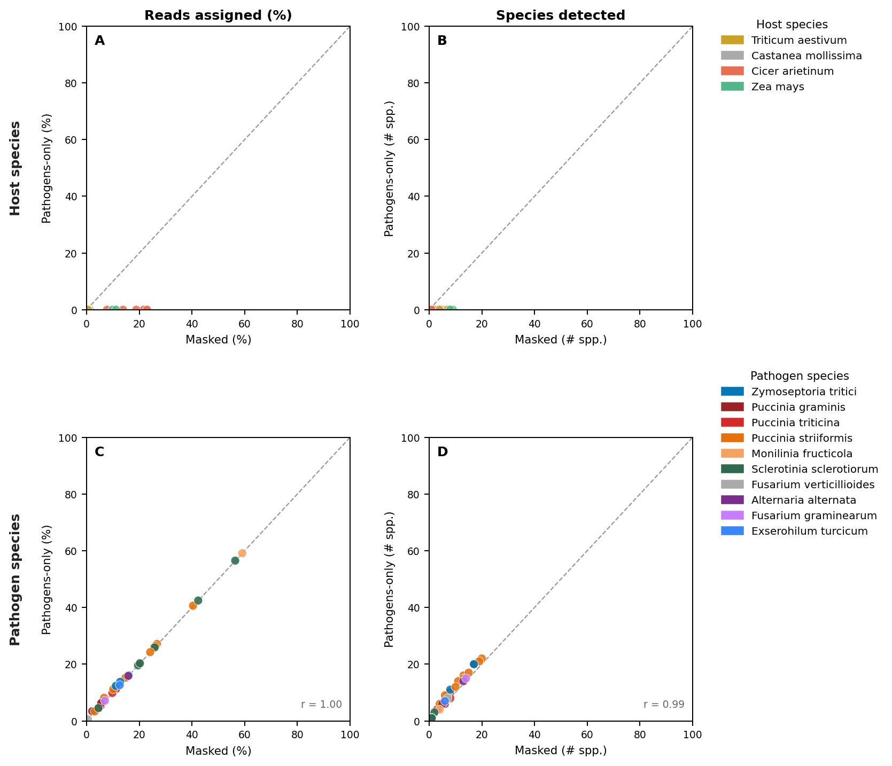

## Figure — Kraken2 database comparison: masked+hosts vs unmasked vs pathogens-only

### Figure 1: Masked+hosts vs unmasked (`masked_vs_unmasked.png`)

### Figure 2: Masked+hosts vs pathogens-only (`masked_vs_pathogens.png`)

### Background and motivation

NCBI STAT pre-computed k-mer taxonomy was used in the upstream pipeline to screen
~593k SRA runs for co-infection signal. Screening microbe-as-library (MAL) runs —
runs where the sequenced organism is itself a PHI-base plant pathogen, and which
should by definition contain pathogen reads — revealed that a large proportion
returned zero detected eukaryotic pathogen reads in STAT. Investigation of the most
affected group, wheat stripe rust (*Puccinia striiformis* f. sp. *tritici*, PST),
confirmed the blind spot: euk_pct = 0% across all PST pilot runs, while Kraken2
and kallisto independently detected *P. striiformis* at 10–68% of reads. STAT's
reference k-mer database inadequately covers Basidiomycota plant pathogens, making
it an unreliable screen for some of the most agronomically important fungal diseases.

To replace STAT, a custom Kraken2 database was built from the CDS of all PHI-base
eukaryotic pathogens (fungi + oomycetes). Three versions were evaluated across
high-confidence field RNA-seq runs (biosample-representative, ≥1 HC pathogen):

- **Unmasked** — pathogen + host CDS used as-is.
- **Masked** — bidirectional BBDuk k-mer masking (`k=35`): pathogens masked against
  shared pathogen k-mers + all host CDS; hosts masked against all pathogen CDS.
- **Pathogens-only** — pathogen CDS only, masked against k-mers shared between
  any two pathogens (pathogen-vs-pathogen masking). No host sequences.

### Figure 1: Why host sequences were removed

**Panels A–B (Host species).**
Even the masked database detects a mean of 4.4 host species per run — biologically
impossible (one host per run). This noise arises from k-mer similarity between
related plant genomes. Masking reduces but cannot eliminate the problem.

**Panels C–D (Pathogen species).**
The masked database is more conservative (mean 18.9% vs 31.9% reads assigned) and
more specific: spurious cross-genus hits in the unmasked results (e.g.
*Melampsora laricis-populina* in wheat rust runs) are eliminated. Species counts
remain well-correlated (*r* = 0.95), confirming masking does not suppress genuine
detections.

### Figure 2: Effect of removing host sequences

**Panels A–B (Host species).**
Pathogens-only assigns effectively zero reads to host species (mean ~0% vs 4.4%
for masked). The host noise problem is completely resolved by excluding host CDS.

**Panels C–D (Pathogen species).**
Pathogen read assignment is broadly consistent between masked+hosts and
pathogens-only (the same dominant species are detected in each run). Pathogens-only
tends to assign slightly more reads to pathogens, as k-mers previously competing
with host sequences are now retained in the pathogen index.

### Key finding

Including host sequences in the database is fundamentally counterproductive.
Host identity is more accurately and efficiently obtained from SRA run metadata
(submitter-declared organism). The pathogens-only database is smaller (~1.9 GB vs
3.4 GB), loads faster on Lustre, and assigns 100% of classified reads to the
pathogen signal of interest.
