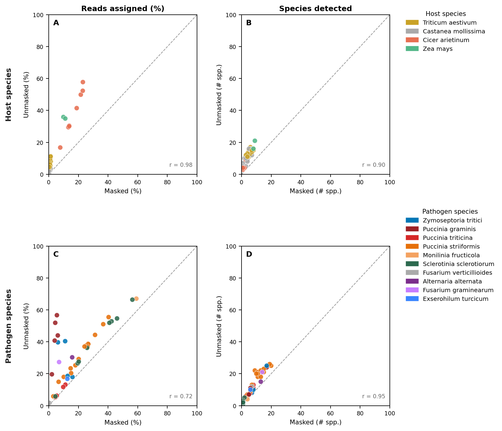

## Figure X — Masked vs unmasked Kraken2 database: host and pathogen read assignment

### Background and motivation

NCBI STAT pre-computed k-mer taxonomy was used in the upstream pipeline to screen
~593k SRA runs for co-infection signal. Screening microbe-as-library (MAL) runs —
runs where the sequenced organism is itself a PHI-base plant pathogen, and which
should by definition contain pathogen reads — revealed that a large proportion
returned zero detected eukaryotic pathogen reads in STAT. Investigation of the most
affected group, wheat stripe rust (*Puccinia striiformis* f. sp. *tritici*, PST),
confirmed the blind spot: euk_pct = 0% across all PST pilot runs, while Kraken2
and kallisto independently detected *P. striiformis* at 10–68% of reads. STAT's
reference k-mer database inadequately covers Basidiomycota plant pathogens, making
it an unreliable screen for some of the most agronomically important fungal diseases.

To replace STAT, a custom Kraken2 database was built from the coding sequences (CDS)
of all PHI-base eukaryotic pathogens (fungi, oomycetes, nematodes; 205 seed taxa,
~15,000 taxids after taxonomic expansion) plus Viridiplantae host CDS for the 180
PHI-base host species. Two versions were evaluated:

- **Unmasked** — reference sequences used as-is.
- **Masked** — bidirectional BBDuk k-mer masking (`k=31`, `kmask=N`): pathogen
  sequences masked against all host CDS and against k-mers shared with any other
  pathogen in the database; host sequences masked against all pathogen CDS. Only
  species-diagnostic k-mers are retained.

### What this figure shows

Four-panel scatter plot comparing the two databases across **41 high-confidence
field RNA-seq runs** (biosample-representative, same-genus secondary pathogens
excluded, streamed from ENA FTP at 500,000 reads per run). Each point is one run;
the dashed line is *y* = *x*; points above the diagonal indicate greater assignment
by the unmasked database. Points are coloured by the dominant host (panels A–B) or
pathogen (panels C–D) species detected in the masked run.

**Panels A–B (Host species).**
Reads classified to host plant taxa and count of distinct host species detected.
Even the masked database detects a mean of 4.4 host species per run (unmasked: 11.0)
— biologically impossible given that each run comes from a single host species.
This noise arises from k-mer similarity between related plant genomes (e.g.
*Triticum aestivum*, *T. turgidum*, *Hordeum vulgare*, and *Brachypodium distachyon*
share large blocks of conserved sequence). Masking reduces but cannot eliminate this
problem because the shared sequence is intrinsic to plant genome evolution.

**Panels C–D (Pathogen species).**
Reads classified to PHI-base eukaryotic pathogens and count of pathogen species
detected. The masked database is more conservative (mean 18.9% vs 31.9% reads
assigned), but more specific: spurious cross-genus hits visible in the unmasked
results (e.g. *Melampsora laricis-populina* in wheat rust runs, *Sorghum bicolor*
in maize runs) are eliminated by masking. Species counts remain well-correlated
between databases (*r* = 0.95), confirming that masking does not suppress genuine
detections. Runs showing extreme displacement above the diagonal in panel C have
high k-mer ambiguity between closely related pathogen species (notably *Puccinia*
spp.) and produce unreliable estimates from either database.

### Key finding

Including host sequences in the database is fundamentally counterproductive.
Host genomes are too similar to each other (and to pathogen sequences) for k-mer
classification to reliably identify a single host species, and the noise they
introduce inflates species counts and competes with pathogen k-mer assignment.
Host identity is more accurately and efficiently obtained from SRA run metadata
(submitter-declared organism), which is available for all runs.

### Path forward

1. **Rebuild the database with pathogen CDS only** — no host sequences.
   Masking becomes pathogen-vs-pathogen: each species is masked against k-mers
   shared with any other pathogen in the database, leaving only species-diagnostic
   signal. The resulting database will be smaller (faster load, no Lustre mmap
   issues on Setonix), and pct_classified will represent pathogen burden directly.

2. **Infer host species from metadata** — use the `host` / `named_host` columns
   already present in `output/02_filter_runs/data/runs.tsv`.

3. **Filter unreliable runs** — exclude runs where unmasked pathogen % greatly
   exceeds masked pathogen % (threshold TBD after pathogen-only DB results are in).
   These runs have insufficient species-diagnostic signal to support confident
   pathogen identification.
