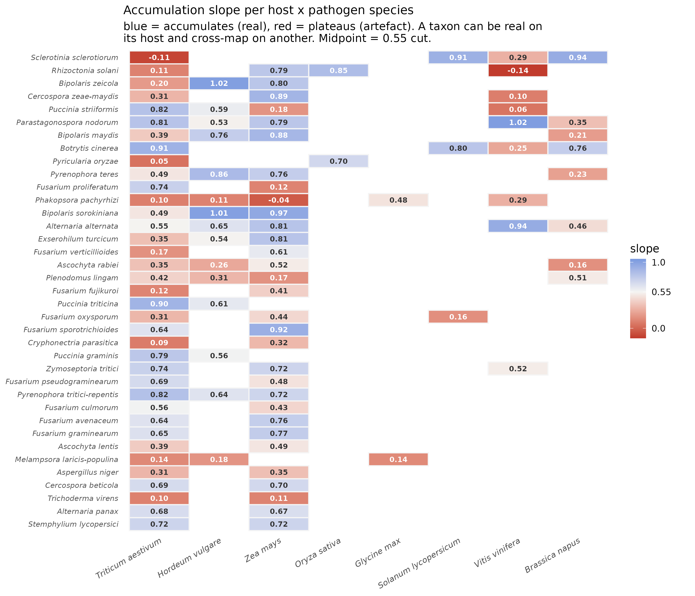

Hey Gang!

Been digging into the Kraken2 data and few things have emerged, think we have some solid methods moving forwards and thought I would give you a quick update. Would love any feed back!

## Telling real infections from noise

How we decide which pathogen detections in the SRA screen are real, and which are
artefacts of the classifier. Short version: a real infection leaves a genome-wide
signal that grows as we sequence deeper; a false one does not.

## The problem

Kraken2 assigns reads to species by matching short genome fragments (k-mers). It is
sensitive, but it over-calls: reads from a conserved region shared across many fungi,
or from a close relative of something genuinely present, get piled onto a species that
was never there. A raw read count cannot separate these from true detections — soybean
rust was "detected" in almost every wheat sample, which is not credible.

## The insight

Count **how much of an organism's genome we actually see** (distinct k-mers), not how
many reads landed on it. A real infection accumulates new kmers as reads increase, so
its cloud **rises**. A false one stacks reads onto the same small fragment, so its cloud
stays **flat** no matter how much data arrives.

*Zymoseptoria* and *Puccinia triticina* on wheat rise cleanly — real. *Melampsora* (poplar rust) on
wheat is flat — noise. *Phakopsora* (soybean rust) is the same organism read on two
hosts: a genuine, rising infection on soybean, and a flat artefact on wheat. The
classifier makes the same call on both; the shape of the cloud tells them apart.

## How we decide

Two numbers per detection:

- **Level** — how much genome we saw (distinct k-mers). A pile-up sits on a floor of
  ~1,000; a real detection reaches tens of thousands to millions.
- **Slope** — whether that coverage grows with more reads. Real ≈ 0.7–0.9; a pile-up
  ≈ 0.

A detection is kept unless it fails **both** — low level *and* flat. Level alone rescues
saturated real infections (soybean rust is flat only because its genome is already fully
covered); slope alone rescues genuine but shallow infections.

## It depends on the host

The same organism can be real on its own host and a cross-mapping artefact on another,
so the test is applied per host, not globally.

Read across a row: *Sclerotinia* is real on canola and soybean (blue) but noise on wheat
(red); stripe rust (*Puccinia striiformis*) is real on wheat but noise on maize. The
colours track known host ranges, which is the check that the method is measuring real
biology. A few cells are ringed: low slope but kept anyway, because coverage is high —
saturated real infections like soybean rust on soybean, where the whole genome is already
seen so it can no longer grow.

## What this changes

The co-infection rate is built from the kept detections only. Applying the filter cuts
roughly a fifth of pathogen detections cohort-wide — the ones the shape shows were never
real — and the survivors are dominated by the pathogens each crop actually gets.

*All figures regenerate from the pipeline; scripts live in `../kraken/assign/figures/`.*
